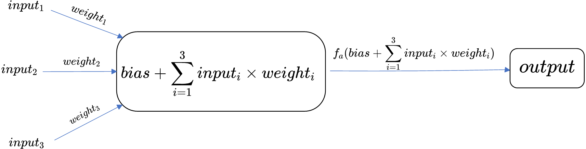
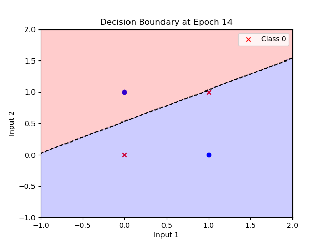

# Perceptron


# Perceptron Structure and Forward Pass

To begin with deep learning and nerual network, we should learn the base: perceptron

In the 1960s, Frank Rosenblatt propose a artificial neural network structure, named Perceptron. The basic unit of this netwrok can simplely describe as a formula, usually called single perceptron

for example:


$$
output =f_{a}( bias + \sum\limits_{i=1}^{3}input_{i}\times weight_{i})
$$
Here is the explain of the formula

- $output$: the output of the unit.

- $f_{a}$: the activation function of the unit.

- $bias$: the bias of the unit, one of parameter of the network

- $input_{i}$: the input singal

- $weight_{i}$: the weight of the input singal, the most important parameter of the netwrok.

In this example, we only have 3 inputs, when we have more inputs, such as we have n inputs, it will be like that:
$$
output =f_{a}( bias + \sum\limits_{i=1}^{n}input_{i}\times weight_{i})
$$

# Activation Functions $f_a$

After understanding the basic structure of perceptrons, let's discuss the role of activation functions. The activation function, denoted as $f_a$ in our earlier formula, is a key component that introduces non-linearity into the neuron's output.

Activation functions are essential components in neural networks that add non-linearity to neuron outputs, allowing the network to learn complex patterns.

## Common Activation Functions

Let's look at a few simple activation functions:

### 1. Step Function

This is the simplest activation function, often used in the original perceptron model:

$$
f(x) = \begin{cases} 
1 & \text{if } x \geq \text{0} \\
0 & \text{otherwise}
\end{cases}
$$

It's like a simple on/off switch, useful for binary classification tasks.

### 2. Sigmoid Function

$$
f(x) = \frac{1}{1 + e^{-x}}
$$

This function "squashes" the input into a range between 0 and 1, making it useful for probabilities or binary classification.

### 3. Rectified Linear Unit (ReLU)

$$
f(x) = \max(0, x)
$$

This function is simple but very effective. It outputs the input directly if it's positive, and 0 otherwise.

## Impact on Learning

The choice of activation function can affect how our perceptron learns:

- With a step function, the perceptron makes clear binary decisions.
- With a sigmoid function, we can get more nuanced, probability-like outputs.
- ReLU allows for faster learning in many cases.

In our upcoming code example, we'll use both the step function and the sigmoid function to see how they affect our perceptron's behavior.

# How Perceptron Learn

Training means using existing data to get suitable weights and bias for the perceptron. The goal is to adjust these parameters so that the perceptron can correctly classify input data.

## The Learning Process

1. **Forward Pass**: First, we input data into the perceptron and calculate its output.
2. **Error Calculation**: We compare this output with the target (which is excepted output).
3. **Parameter Update**: Based on the error, we adjust the weights and bias.

So, the key question is: How do we adjust the weights and bias?

## Intuition Behind the Learning Rule

The basic idea is simple and intuitive:
- If the perceptron's prediction is too high, we need to decrease the weights.
- If the prediction is too low, we need to increase the weights.
- The amount of adjustment should be proportional to the error and the input value.

This intuition leads us to the Delta rule, also known as the Perceptron Learning Rule.

## The Delta Rule

The Delta rule, proposed by Frank Rosenblatt along with the perceptron, provides a method to update weights and bias:

For weights:
$$
\Delta weight_{i} = learning\_rate * (target - output) * input_{i} \\
weight_{i} = weight_{i} + \Delta weight_{i}
$$

For bias:
$$
\Delta bias = learning\_rate * (target - output) * 1 \\
bias = bias + \Delta bias
$$

Here's what each part means:
- $learning\_rate$: A small positive number that controls the size of each adjustment.
- $(target - output)$: The prediction error. This determines the direction and magnitude of the update.
- $input_{i}$: The input value. This ensures that inputs contributing more to the output are adjusted more.

This rule ensures that:
1. Weights associated with larger inputs are adjusted more.
2. Larger errors lead to larger adjustments.
3. The direction of adjustment (increase or decrease) is determined by the sign of the error.

> A more explain about the different between $\Delta weight$ and $\Delta bias$ 
>
> if we treat the bias as $weight_{0}$, and there is a default $input_{0}=1$, then the formula will be more succinct
> $$
> output =f_{a}(\sum\limits_{i=0}^{3}input_{i}\times weight_{i})
> $$
> for computer programming, it highly recommand because more easy to archieve; but hard for people understand
>
> and we can use Delta rule to conclude the second bias change rule.

By repeatedly applying this rule on many examples, the perceptron gradually improves its performance, adjusting its decision boundary to better classify the input data.

## About Learning rate


# Talk is cheap, show me the code

let's try to solve a problem

## About Initialize the parameters

about initialize the the weights and bias, we first use simple way. 

for weight, we use randomly and uniform distribution, such as `[-0.5, 0.5]`, and for bias we set it to 0

more complex initialize will discuss in next chapter

## Use perceptron to realize the AND / OR Gate

### Input and Target data

```python
Input = np.array([
    [1, 1],
    [1, 0],
    [0, 1],
    [0, 0]
])

Target_AND_Gate = np.array([
    1,
    0,
    0,
    0
])

Target_OR_Gate = np.array([
    1,
    1,
    1,
    0
])
```

### Single Percetpron class

```python
import numpy as np

class Perceptron():
    """
    A simple implementation of the Perceptron algorithm
    """

    def __init__(self, input_size, activation_function, learning_rate) -> None:
        self.weights = np.random.uniform(-0.5, 0.5, input_size)
        self.bias = 0
        self.activation_function = activation_function
        self.learning_rate = learning_rate
    
    # forward process
    def forward(self, input):
        return self.activation_function(np.dot(input, self.weights.T) + self.bias)
    
    # Delta learning rule
    def adjust_weight(self, input, target, output):
        return self.learning_rate * (target - output) * input
    
    def adjust_bias(self, target, output):
        return self.learning_rate * (target - output) * 1
    
    # train 1 input
    def train_once(self, input, target):
        output = self.forward(input)
        if output != target:
            self.weights += self.adjust_weight(input, target, output)
            self.bias += self.adjust_bias(target, output)
        return output
    
    # train all input, Input is the all input matrix
    def train(self, epochs, Input, Target):
        for i in range(epochs):
            Output = []
            for j in range(Input.shape[0]):
                output = self.train_once(input=Input[j], target=Target[j])
                Output.append(output)
            
            # print the weight and bias every time, it used to be 10 times but I find that it usually only not more than 10 times
            print(f"{i} epoch, Weights:{self.weights}, Bias: {self.bias}")
            
            if np.array_equal(np.array(Output), Target):
                print(f"Training completed in {i} epochs")
                break
            else:
                print(f"Training did not converage in {epochs} epochs")
    
    # predict for the new inputs
    def predict(self, Input):
        Output = []
        for input in Input:
            Output.append(self.forward(input))
        return Output
```

### activation fucntion

```python
# this file define the activation function that forward propagation use
# now these function only used for signle number deal with
import math

def step_fucntion(x):
    return 1 if x > 0 else 0

def sign_function(x):
    if x > 0:
        return 1
    elif x == 0:
        return 0
    elif x < 0:
        return -1

def sigmoid_function(x):
    return 1 / (1+math.exp(-x))

def ReLU_function(x):
    return x if x > 0 else 0
```

### Run and draw picture

to run the code, we should:

```python
learning_rate = 0.1

perceptron = Perceptron(Input.shape[1], step_fucntion, learning_rate)
perceptron.train(epochs=100, Input=Input, Target=Target_OR_Gate)
Output = perceptron.predict(Input)
print(f"here is my training Output: {Output}")
```

for we can draw the pciture to show more directly about the trainning, we should do a little bit change for the Percetpron class

```python
# previous code
import matplotlib.pyplot as plt

class Perceptron():
    """
    A simple implementation of the Perceptron algorithm
    """

    # ... exist code
    
    # train all input, Input is the all input matrix
    def train(self, epochs, Input, Target):
        # start plt interactive mode
        plt.ion()
        
        # ... exist code
        
        # close matplot interactive mode
        plt.ioff()
        # show last picture
        plt.show()
    
    # ... exist code
    
    # draw picture, provide by o1
    def plot_decision_boundary(self, Input, Target, epoch):
        # 2-demension data only
        if Input.shape[1] != 2:
            print("sorry, only can draw 2-dimension data")
            return

        # clear all
        plt.clf()

        # draw point
        for i in range(len(Input)):
            if Target[i] == 1:
                plt.scatter(Input[i][0], Input[i][1], color='blue', marker='o', label='Class 1' if i == 0 else "")
            else:
                plt.scatter(Input[i][0], Input[i][1], color='red', marker='x', label='Class 0' if i == 0 else "")

        # create grid
        x_min, x_max = Input[:, 0].min() - 1, Input[:, 0].max() + 1
        y_min, y_max = Input[:, 1].min() - 1, Input[:, 1].max() + 1
        xx, yy = np.meshgrid(np.linspace(x_min, x_max, 200), np.linspace(y_min, y_max, 200))
        grid = np.c_[xx.ravel(), yy.ravel()]
        Z = np.array([self.forward(point) for point in grid])
        Z = Z.reshape(xx.shape)

        # boundary
        plt.contourf(xx, yy, Z, alpha=0.2, levels=np.linspace(0, 1, 3), colors=['red', 'blue'])
        plt.contour(xx, yy, Z, levels=[0.5], colors='black', linestyles='--')

        plt.xlabel('Input 1')
        plt.ylabel('Input 2')
        plt.title(f'Decision Boundary at Epoch {epoch}')
        plt.legend()

        # renew every 0.3 s
        plt.pause(0.3)

```

### End of the example

in this example, we use perceptron to realize the AND and OR gate, and we use `numpy` to manpulate the matrix multiplication.

But in our activation function, it only deal with 1 number, and in our Percetpron class, the `adjust_weight` , `adjust_bias` and `train_once` also just deal with single number.

If we use large-scale use the `np.array` these operation will be more succinct code, we will try in next chapter / example.

## XOR Gate

we already use single perceptron to resolve the AND / OR Gate, let's try to realize another XOR Gate

so we have the Input and Target:

```python
Input = np.array([
    [1, 1],
    [1, 0],
    [0, 1],
    [0, 0]
])
Target_XOR_Gate = np.array([
    0,
    1,
    1,
    0
])
```

But when we train, we get following:

```powershell
0 epoch, Weights:[ 0.33238207 -0.33962529], Bias: 0.0
1 epoch, Weights:[ 0.33238207 -0.23962529], Bias: 0.0
2 epoch, Weights:[ 0.23238207 -0.23962529], Bias: 0.0
3 epoch, Weights:[ 0.23238207 -0.13962529], Bias: 0.0
4 epoch, Weights:[ 0.13238207 -0.13962529], Bias: 0.0
5 epoch, Weights:[ 0.13238207 -0.03962529], Bias: 0.0
...
99 epoch, Weights:[ 0.13238207 -0.03962529], Bias: 0.0
Training did not converage in 100 epochs
here is my training Output: [1, 1, 0, 0]
```

when it comes to a set of weights and bias, it not be trained but stucked.

let us try to analyse this situation, we use the Wights `[ 0.13238207, -0.03962529]` and bias `0`

### Turn 1

1. forward process
   $$
   f_a([1, 1] * [ 0.13238207, -0.03962529] + 0 = 0.09275677999999998) = 1
   $$

2. Delta rule
   $$
   \Delta weight = 0.1 * (0 - 1) * [1, 1] = [-0.1, -0.1] \\
   \Delta bias = 0.1 * (0 - 1) * 1 = -0.1
   $$

3. current weights and bias
   $$
   weight = [0.03238207, -0.13962529]\\
   bias = -0.1
   $$

### Turn 2

1. forward process: $$f_a([1, 0] * [0.03238207, -0.13962529] + (-0.1) = -0.06761793) = 0$$ 
2. Delta rule: $$\Delta weight = 0.1 * (1 - 0) * [1, 0] = [0.1, 0] \\
   \Delta bias = 0.1 * (1 - 0) * 1 = 0.1$$

3. weights and bias: $$weight = [0.13238207, -0.13962529]\\
   bias = 0$$

### Trun 3

1. forward process: $$f_a([0, 1] * [0.13238207, -0.13962529] + 0 = -0.13962529) = 0$$
2. Delta rule: $$\Delta weight = 0.1 * (1 - 0) * [0, 1] = [0, 0.1] \\
   \Delta bias = 0.1 * (1 - 0) * 1 = 0.1$$
3. weight and bias: $$weight = [0.13238207, -0.03962529]\\
   bias = 0.1$$

### Trun 4

1. forward process: $$f_a([0, 0] * [0.13238207, -0.03962529] + 0.1 = 0.1) = 1$$
2. Delta rule: $$\Delta weight = 0.1 * (0 - 1) * [0, 0] = [0, 0] \\
   \Delta bias = 0.1 * (0 - 1) * 1 = -0.1$$
3. weight and bias: $$weight = [0.13238207, -0.03962529]\\
   bias = 0$$

In this process, we can see a full process that how the weights and bias change and change back.

And one more thing we should notice is that, why the parameter will be change back, because we use only 1 input to update the parameter, and then use the updated paramter to forward next input.

If we can make a batch input forward process, do you think it will be better for now? at least the paramter will always update, not stuck in here

### The essence of XOR problem

XOR problem is not the single perceptorn can resolved, because it not

as shown in the follwoing picture, we can't use 1 line to distinguish points



# Deeper think about the XOR

if we have AND Gate and OR Gate, actually we can construct a XOR gate, like following graph:


so that means use MLP(muliple layer perceptron) may can resolve the problem, and let's jump into Ch02, which will introduce MLP, and most important BP algorithm

# Next step

我们应该继续学习XOR问题。这是一个非常重要的步骤，原因如下：

1. XOR问题的重要性：
   XOR（异或）问题在神经网络的历史中占有重要地位。它是一个简单但非常有启发性的问题，展示了单层感知器的局限性，同时也引出了多层神经网络的必要性。

2. 理解线性可分与非线性可分：
   通过对比AND、OR和XOR问题，我们可以深入理解线性可分和非线性可分问题的区别。这是理解神经网络能力的关键。

3. 引入多层感知器：
   XOR问题无法用单个感知器解决，这自然引导我们进入多层感知器（MLP）的学习。这是向更复杂的神经网络结构过渡的重要一步。

4. 理解隐藏层的作用：
   通过实现解决XOR问题的多层感知器，我们可以直观地理解隐藏层在神经网络中的作用，即如何将非线性问题转化为线性可分的问题。

5. 学习反向传播：
   XOR问题为学习反向传播算法提供了一个很好的起点。这是训练多层神经网络的核心算法。

6. 可视化和理解：
   XOR问题在二维平面上很容易可视化，这有助于我们直观地理解神经网络如何学习复杂的决策边界。

接下来的步骤可以是：

1. 尝试用单个感知器解决XOR问题，观察其失败。
2. 设计一个简单的多层感知器（通常两层足够）来解决XOR问题。
3. 实现前向传播算法。
4. 学习并实现反向传播算法。
5. 训练网络并观察其如何成功解决XOR问题。
6. 可视化结果，包括决策边界的变化过程。

通过这个过程，我们可以自然地过渡到更复杂的神经网络结构和算法，为进一步学习深度学习打下坚实的基础。您觉得这个计划如何？我们可以从哪一步开始？


您遇到的问题是非常典型的，这正好展示了单层感知器无法解决XOR问题的原因。让我来解释一下为什么会出现这种情况，以及我们接下来应该如何处理：

1. XOR问题的本质：
   XOR（异或）问题是一个非线性可分的问题。这意味着在二维平面上，无法用一条直线将两类数据点完全分开。

2. 单层感知器的局限性：
   单层感知器只能学习线性决策边界。它试图找到一条直线（在高维情况下是一个超平面）来分隔不同类别的数据点。

3. 为什么权重停止更新：
   在您的情况中，感知器找到了一个权重组合，使得它对某些输入正确，对某些输入错误。但是，由于问题的非线性性质，无论如何调整这条直线（决策边界），都无法同时正确分类所有四个点。因此，权重的更新最终会陷入一种循环或停滞状态。

4. Delta学习规则的局限性：
   Delta学习规则在这种情况下确实起作用了，但它无法找到一个完美的解决方案，因为完美的线性解决方案根本不存在。

解决方案和下一步：

1. 验证单层感知器的局限性：
   - 尝试用同样的代码解决AND和OR问题，您会发现它们可以被成功解决，因为它们是线性可分的。
   - 这个实验清楚地展示了单层感知器可以解决的问题类型和它的局限性。

2. 引入多层感知器（MLP）：
   - XOR问题需要至少两层的神经网络（一个隐藏层和一个输出层）来解决。
   - 多层结构允许网络学习更复杂的非线性决策边界。

3. 实现一个简单的多层感知器：
   - 创建一个新的类，比如 `MultilayerPerceptron`，它应该包含至少一个隐藏层。
   - 实现前向传播算法，允许信号通过多层网络传递。

4. 学习反向传播算法：
   - 单层感知器的Delta规则不足以训练多层网络。我们需要学习和实现反向传播算法。
   - 反向传播允许误差信号从输出层反向传播到前面的层，从而调整所有层的权重。

5. 重新训练XOR问题：
   - 使用新实现的多层感知器和反向传播算法来训练XOR问题。
   - 您应该能够看到网络成功地学习到正确的分类。

6. 可视化结果：
   - 修改您的可视化代码以适应多层网络的输出。
   - 观察决策边界如何从线性变为非线性，最终正确分类所有四个XOR输入点。

这个过程不仅会解决XOR问题，还会让您深入理解神经网络的工作原理，以及为什么深度学习如此强大。您准备好开始实现多层感知器了吗？如果是，我可以指导您完成第一步。
