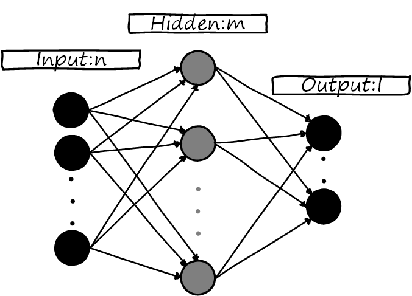

# Back Propagation

let's consideer a general full connection MLP topology, show as following:

Input layer n nodes and Hidden layer m nodes, and output layer l nodes

# Expand matrix for all layer

## $Input_{1\times n}$

$$
Input_{1\times n} = 
\begin{bmatrix}
input_0 & input_1 & \cdots & input_{n-1}
\end{bmatrix}_{1\times n}
$$

## $Weights^{hidden} \& Bias^{hidden}$ 

Hidden Layer weights and bias
$$
\begin{bmatrix}
Bias^{hidden}_{1\times m}\\
Weights^{hidden}_{n\times m}
\end{bmatrix}_{(n+1)\times m}=
\begin{bmatrix}
b_0^{hidden} & b_1^{hidden} & \cdots & b_{m-1}^{hidden} \\
w_{00}^{hidden} & w_{01}^{hidden} & \cdots & w_{0(m-1)}^{hidden} \\
w_{10}^{hidden} & w_{11}^{hidden} & \cdots & w_{1(m-1)}^{hidden} \\
\vdots & \vdots & \ddots & \vdots \\
w_{(n-1)0}^{hidden} & w_{(n-1)1}^{hidden} & \cdots & w_{(n-1)(m-1)}^{hidden}
\end{bmatrix}_{(n+1)\times m}
$$

> why we use this kind of format of Bias and Weights, it will be used for code and programing realize, we will see later Forward propagete

## $Weights^{output} \& Bias^{output}$

Output Layer  weights and bias
$$
\begin{bmatrix}
Bias^{output}_{1\times l}\\
Weights^{output}_{m\times l}
\end{bmatrix}_{(m+1)\times l}=
\begin{bmatrix}
b_0^{output} & b_1^{output} & \cdots & b_{l-1}^{output} \\
w_{00}^{output} & w_{01}^{output} & \cdots & w_{0(l-1)}^{output} \\
w_{10}^{output} & w_{11}^{output} & \cdots & w_{1(l-1)}^{output} \\
\vdots & \vdots & \ddots & \vdots \\
w_{(m-1)0}^{output} & w_{(m-1)1}^{output} & \cdots & w_{(m-1)(l-1)}^{output}
\end{bmatrix}_{(m+1)\times l}
$$
## $Output_{1\times l}$

$$
Output_{1\times l}=
\begin{bmatrix}
output_0 & output_1 & \cdots & output_{l-1}
\end{bmatrix}_{1\times l}
$$
## $Target_{1\times l}$ 

our trainning goal
$$
Target_{1\times l}=
\begin{bmatrix}
target_0 & target_1 & \cdots & target_{l-1}
\end{bmatrix}_{1\times l}
$$
## $Loss$

our loss function
$$
\begin{align}
Loss &= \frac{1}{l}\times(Target-Output)^2\\
      &=\frac{1}{l}\times\sum_{i=0}^{l-1}(target_{i}-output_{i})^2
\end{align}
$$

$f_a$ is activation funciton

# Forward propagate

let's go through again for the forward propagete and use some special symbol to mark some intermediate calcualtion results. This symbol can help us to get succinct result in back propagation

## Input --> Hidden

let's first define $Net_{1\times m}^{hidden}$ which is the input value of the Hidden layer actication function
$$
Net_{1\times m}^{hidden} \triangleq Input_{1\times n} \cdot Weights_{n\times m}^{hidden} + Bias_{1\times m}^{hidden}
$$

and then we define $Hidden_{1\times m}$ which is the output of the Hidden layer
$$
Hidden_{1\times m} \triangleq f_a(Net_{1\times m}^{hidden})
$$
as finally we will use matrix multiplication to express this process (because it more convinence to code and programing). we will have following:
$$
\begin{align}

Net_{1\times m}^{hidden} 

&\triangleq 
Input_{1\times n} \cdot Weights_{n\times m}^{hidden} + Bias_{1\times m}^{hidden}

\\ 
\\

&= 
\begin{bmatrix}
1 & Input_{1\times n}
\end{bmatrix}_{1\times n+1}
\cdot
\begin{bmatrix}
Bias^{hidden}_{1\times m}\\
Weights^{hidden}_{n\times m}
\end{bmatrix}_{(n+1)\times m}

\\
\\

&=
\begin{bmatrix}
1 & input_0 & input_1 & \cdots & input_{n-1}
\end{bmatrix}_{1\times n+1}
\cdot
\begin{bmatrix}
b_0^{hidden} & b_1^{hidden} & \cdots & b_{m-1}^{hidden} \\
w_{00}^{hidden} & w_{01}^{hidden} & \cdots & w_{0(m-1)}^{hidden} \\
w_{10}^{hidden} & w_{11}^{hidden} & \cdots & w_{1(m-1)}^{hidden} \\
\vdots & \vdots & \ddots & \vdots \\
w_{(n-1)0}^{hidden} & w_{(n-1)1}^{hidden} & \cdots & w_{(n-1)(m-1)}^{hidden}
\end{bmatrix}_{(n+1)\times m}

\\
\\

&=
\begin{bmatrix}
b_0^{hidden}+\sum_{i=0}^{n-1} (input_i\times w_{i0}^{hidden}) &
\cdots &
b_{m-1}^{hidden}+\sum_{i=0}^{n-1} (input_i\times w_{i(m-1)}^{hidden})
\end{bmatrix}_{1\times m}

\\
\\

&\triangleq 
\begin{bmatrix}
net_0^{hidden} & net_1^{hidden} & \cdots & net_{m}^{hidden}
\end{bmatrix}_{1\times m}

\end{align}
$$
in summary we have
$$
Hidden_{1\times m} = f_a(Net_{1\times m}^{hidden}) \quad \Rightarrow \quad hidden_i = f_a(net_i^{hidden}) \quad i \in [0, m-1]
$$

## Hidden --> Output

similar to the above, we have
$$
\begin{align}
Net_{1\times l}^{output} 
&\triangleq 

Hidden_{1\times m} \cdot Weights_{m\times l}^{output}+Bias_{1\times l}^{output}
\\
\\
&=
\begin{bmatrix}
1 & Hidden_{1\times m}
\end{bmatrix}_{1\times (m+1)}
\cdot
\begin{bmatrix}
Bias_{1\times l}^{output} \\
Weights_{m\times l}^{output}
\end{bmatrix}_{(m+1)\times l}

\\
\\
&=
\begin{bmatrix}
1 & hidden_0 & hidden_1 & \cdots & hidden_{m-1}
\end{bmatrix}_{1\times (m+1)}
\cdot
\begin{bmatrix}
b_0^{output} & b_1^{output} & \cdots & b_{l-1}^{output} \\
w_{00}^{output} & w_{01}^{output} & \cdots & w_{0(l-1)}^{output} \\
w_{10}^{output} & w_{11}^{output} & \cdots & w_{1(l-1)}^{output} \\
\vdots & \vdots & \ddots & \vdots \\
w_{(m-1)0}^{output} & w_{(m-1)1}^{output} & \cdots & w_{(m-1)(l-1)}^{output}
\end{bmatrix}_{(m+1)\times l}
\\
\\
&=
\begin{bmatrix}
b_0^{output}+\sum_{i=0}^{m-1}hidden_i\times w_{i0}^{output} & \cdots & b_{l-1}^{output}+\sum_{i=0}^{m-1}hidden_i\times w_{i(l-1)}^{output}
\end{bmatrix}_{1\times l}
\\
\\
&\triangleq
\begin{bmatrix}
net_0^{output} & net_1^{output} & \cdots & net_{l-1}^{output}
\end{bmatrix}_{1\times l}
\end{align}
$$
In summary we have
$$
Output_{1\times l} = f_a(Net_{1\times l}^{output}) \quad \Rightarrow \quad output_i = f_a(net_i^{output}) \quad i \in [0, l-1]
$$

# Expand Loss function

Let's not lose sight of our goal: we want to find a way to adjust weights and biases to minimize the loss function. 

Now that we've expanded the forward propagation, let's express the loss function in terms of our existing matrices and variables:
$$
\begin{align}
Loss 
&= \frac{1}{l}\times(Target-Output)^2\\

&=\frac{1}{l}\times\sum_{i=0}^{l-1}(target_{i}-output_{i})^2 \\

&= \frac{1}{l}\times\sum_{i=0}^{l-1}(target_{i}-f_a(net_i^{output}) )^2 \\

&= \frac{1}{l}\times\sum_{i=0}^{l-1}(target_{i}-f_a(b_i^{output}+\sum_{j=0}^{m-1}hidden_j\times w_{ji}^{output}) )^2 \\

&= \frac{1}{l}\times\sum_{i=0}^{l-1}(target_{i}-f_a(b_i^{output}+\sum_{j=0}^{m-1}(f_a(net_j^{hidden}) )\times w_{ji}^{output}) )^2 \\

&= \frac{1}{l}\times\sum_{i=0}^{l-1}(target_{i}-f_a(b_i^{output}+\sum_{j=0}^{m-1}(f_a(b_j^{hidden}+\sum_{k=0}^{n-1} (input_k\times w_{kj}^{hidden})) )\times w_{ji}^{output}) )^2
\end{align}
$$
Now that we've fully expanded the loss function, let's identify which terms are variables and which are constants. 

Since our goal is to adjust the weights and biases, our variables are:
$$
b_i^{output}, b_j^{hidden}, w_{kj}^{hidden}, w_{ji}^{output}
$$
The constants in our function are (note that we're focusing on a single input, so input values are also constant):
$$
target_i, input_k
$$
Therefore, we can express our loss function as:
$$
Loss = Loss(b_i^{output}, b_j^{hidden}, w_{kj}^{hidden}, w_{ji}^{output}) \\
i \in [0, l-1] \\
j \in [0, m-1] \\
k \in [0, n-1]
$$
Our problem now becomes: How do we adjust the variables of this multivariate function to minimize its value?

This is where Gradient Descent comes into play.

# Gradient Descent

For complex multivariate functions like our loss function, finding an analytical solution is often challenging. Therefore, we turn to numerical methods, which are more commonly used for such complex functions. In this case, we'll employ Gradient Descent. 

> You may have heard of Stochastic Gradient Descent (SGD). 
>
> "Stochastic" means that in each epoch, we use a random sample to train the model. 
>
> In contrast, we have Batch Gradient Descent (BGD), where we use the entire training set in each epoch.

To understand gradient descent, let's revisit the definition of a gradient for a multivariate function. The gradient points in the direction of steepest increase for the function with respect to its variables. 

Gradient descent leverages this property by moving in the opposite direction of the gradient to minimize the function. We can express this mathematically for our neural network parameters:
$$
\begin{align}
\Delta b_i^{output} &= - \eta \times \frac{\partial Loss}{\partial (b_i^{output})} \\
\Delta b_j^{hidden} &= - \eta \times \frac{\partial Loss}{\partial (b_j^{hidden})}\\
\Delta w_{kj}^{hidden}&= - \eta \times \frac{\partial Loss}{\partial (w_{kj}^{hidden})}\\
\Delta w_{ji}^{output} &= - \eta \times \frac{\partial Loss}{\partial (w_{ji}^{output})}
\end{align}
$$
Here, $\eta$ represents the learning_rate, which controls the step size of our updates. 
$$
\eta \triangleq learning\_rate
$$
By iteratively applying these updates, we can gradually adjust our network's parameters to minimize the loss function. This iterative process forms the core of the training loop in neural networks.

now let's calculate these 4 partial derivative, but we will first caucalute the output layer weights and bias beucase it closest with the output.

## $\partial Loss / \partial (b_i^{output})$

Let's consider the expanded form of our Loss function:
$$
Loss 
= \frac{1}{l}\times\sum_{i=0}^{l-1}(target_{i}-output_{i})^2
$$
where $l$ is the number of output neurons.

Applying the chain rule, we can express the partial derivative as:
$$
\frac{\partial Loss}{\partial (b_i^{output})} 
= \frac{\partial Loss}{\partial (output_i)} \times \frac{\partial (output_i)}{\partial (net_i^{output})} \times \frac{\partial (net_i^{output})}{\partial (b_i^{output})}
$$

> ! important
>
> In the following derivations, $i$, $j$, and $k$ represent specific, fixed indices rather than general variables. This distinction will become clear in subsequent calculations.

### $\partial Loss / \partial (output_i)$

$$
\begin{align}
\frac{\partial Loss}{\partial (output_i)} &= 
\frac{1}{l} \times \frac {\partial [(target_0-output_0)^2+\cdots+(target_i-output_i)^2+\cdots+(target_{l-1}-output_{l-1})^2] } { \partial (output_i) } \\

&= \frac{1}{l} \times \frac {\partial [(target_i-output_i)^2] } { \partial (output_i) }
= \frac{1}{l}\times \frac {\partial (target_i^2+output_i^2-2target_ioutput_i)} { \partial (output_i) }
\\
&= \frac{1}{l}\times(2output_i-2target_i) = \frac{2}{l}\times(output_i-target_i)
\end{align}
$$

### $\partial (output_i) / \partial (net_i^{output}) $

$$
\frac{\partial (output_i)}{\partial (net_i^{output})} = \frac {\partial f_a(net_i^{output})} {\partial net_i^{output}}=f_a^{'}(net_i^{output})
$$

where $f_a$ is the activation function.

### $\partial (net_i^{output}) / \partial (b_i^{output})$

$$
\frac{\partial (net_i^{output})}{\partial (b_i^{output})} = \frac{\partial( b_i^{output}+\sum_{p=0}^{m-1}hidden_p\times w_{pi}^{output})}{\partial (b_i^{output})} = 1
$$

where $m$ is the number of neurons in the hidden layer.

## $\partial Loss / \partial (w_{ji}^{output})$

Similar to our approach for the bias, we can express the partial derivative of the loss with respect to the output layer weights using the chain rule:
$$
\frac{\partial Loss}{\partial (w_{ji}^{output})} 
= \frac{\partial Loss}{\partial (output_i)} \times \frac{\partial (output_i)}{\partial (net_i^{output})} \times \frac{\partial (net_i^{output})}{\partial (w_{ji}^{output})}
$$
We've already calculated $\partial Loss / \partial output_i$ and $\partial output_i / \partial net_i^{output}$ in the previous section. To simplify our notation, let's introduce a new term, $\delta_i^{output}$, known as the "error term" for the output layer:

so we give another symbol to the $\partial Loss / \partial (output_i) \times \partial (output_i) / \partial (net_i^{output}) $
$$
\begin{align}
\delta_i^{output} &\triangleq \frac{\partial Loss}{\partial (output_i)} \times \frac{\partial (output_i)}{\partial (net_i^{output})}
\\
&=\frac{2}{l}\times(output_i-target_i)\times f_a^{'}(net_i^{output})\\
&=-\frac{2}{l}\times[target_i-f_a(net_i^{output})]\times f_a^{'}(net_i^{output})
\end{align}
$$

Now, we only need to calculate $\partial net_i^{output} / \partial w_{ji}^{output}$ to complete our derivation.

### $\partial (net_i^{output}) / \partial (w_{ji}^{output})$

$$
\begin{align}
\frac{\partial (net_i^{output})}{\partial (w_{ji}^{output})} &= \frac{\partial( b_i^{output}+\sum_{p=0}^{m-1}hidden_p\times w_{pi}^{output})}{\partial (w_{ji}^{output})} 
\\
\\
&=\frac{\partial(hidden_0\times w_{0i}^{output}+\cdots+hidden_j\times w_{ji}^{output}+\cdots+hidden_{m-1}\times w_{(m-1)i}^{output})}{\partial (w_{ji}^{output})} 
\\
\\
&= hidden_j

\end{align}
$$

## $\Delta b_i^{output} \quad  \Delta w_{ji}^{output}$

We've derived the partial derivatives for both the weights and biases in the output layer. Let's summarize these results which using the error term $\delta_i^{output}$ defined earlier:
$$
\Delta b_i^{output} = - \eta \times \frac{\partial Loss}{\partial (b_i^{output})} = - \eta \times \delta_i^{output} \times1
\\ 
\Delta w_{ji}^{output} = - \eta \times \frac{\partial Loss}{\partial (w_{ji}^{output})} = - \eta \times \delta_i^{output} \times hidden_j
$$
then let's try to deal with the hidden layer adjustment

## $\partial Loss / \partial (b_j^{hidden})$

follow the same above process, we get
$$
\frac{\partial Loss}{\partial (b_j^{hidden})} 
= \frac{\partial Loss}{\partial (output_i)} \times \frac{\partial (output_i)}{\partial (net_i^{output})} \times \frac{\partial (net_i^{output})}{\partial (hidden_j)} \times \frac{\partial(hidden_j)}{\partial(net_j^{hidden})} \times \frac{\partial(net_j^{hidden})}{{\partial (b_j^{hidden})}} \\
$$

### hidden layer $\delta$

similarly let's define another $\delta$
$$
\begin{align}
\delta_j^{hidden} &\triangleq \frac{\partial (net_i^{output})}{\partial (hidden_j)} \times \frac{\partial(hidden_j)}{\partial(net_j^{hidden})} 
\\
\\
\text{where} \quad \frac{\partial (net_i^{output})}{\partial (hidden_j)} &= \frac{\partial (b_i^{output}+\sum_{p=0}^{m-1}hidden_p\times w_{pi}^{output})}{\partial (hidden_j)} 
\\
\\
&= \frac{\partial (hidden_0\times w_{0i}^{output}+\cdots+hidden_j\times w_{ji}^{output}+\cdots+hidden_{m-1}\times w_{(m-1)i}^{output})}{\partial (hidden_j)}
\\
\\
&=w_{ji}^{output}

\\
\\
\text{and} \quad \frac{\partial(hidden_j)}{\partial(net_j^{hidden})} &=f_a^{'}(net_j^{hidden})
\end{align}
$$
so we get simplified formula
$$
\frac{\partial Loss}{\partial (b_j^{hidden})} 
= \delta_i^{output} \times \delta_j^{hidden} \times \frac{\partial(net_j^{hidden})}{{\partial (b_j^{hidden})}}
$$

### $\partial(net_j^{hidden}) / \partial (b_j^{hidden})$

finally we can only calcualte the last part of the formula
$$
\frac{\partial(net_j^{hidden})}{{\partial (b_j^{hidden})}} = \frac{\partial [b_j^{hidden}+\sum_{p=0}^{n-1} (input_p\times w_{pj}^{hidden})]}{\partial (b_j^{hidden})}=1
$$

## $\partial Loss / \partial (w_{kj}^{hidden})$

now we can fast write down the expression of the partial derivative, with above mathematical sign
$$
\frac{\partial Loss}{\partial (w_{kj}^{hidden})} = \delta_i^{output} \times \delta_j^{hidden} \times \frac{\partial(net_j^{hidden})}{{\partial (w_{kj}^{hidden})}}
$$

### $\partial(net_j^{hidden}) / \partial (w_{kj}^{hidden})$

$$
\begin{align}
\frac{\partial(net_j^{hidden})}{{\partial (w_{kj}^{hidden})}} 
&= \frac{\partial [b_j^{hidden}+\sum_{p=0}^{n-1} (input_p\times w_{pj}^{hidden})]}{\partial (w_{kj}^{hidden})} 
\\
&= \frac{\partial (input_0\times w_{0j}^{hidden}+\cdots+input_k\times w_{kj}^{hidden}+\cdots+input_{n-1}\times w_{(n-1)j}^{hidden})}{\partial (w_{kj}^{hidden})} \\
&=input_k
\end{align}
$$

## $\Delta b_j^{hidden} \quad \Delta w_{kj}^{hidden}$

in summary, we get
$$
\Delta b_j^{hidden} 
= - \eta \times \frac{\partial Loss}{\partial (b_j^{hidden})}
=
- \eta \times \delta_i^{output} \times \delta_j^{hidden} \times 1
\\
\Delta w_{kj}^{hidden}
= - \eta \times \frac{\partial Loss}{\partial (w_{kj}^{hidden})}
=  - \eta \times \delta_i^{output} \times \delta_j^{hidden} \times input_k
$$

# Extending Adjustment Patterns to Deeper Network

Let's summarize the adjustment formulas for each parameter:
$$
\Delta b_i^{output} =  - \eta \times \delta_i^{output} \times 1
\\ 
\Delta w_{ji}^{output} = - \eta \times \delta_i^{output} \times hidden_j
\\
\Delta b_j^{hidden} 
= - \eta \times \delta_i^{output} \times \delta_j^{hidden} \times 1
\\
\Delta w_{kj}^{hidden}
=  - \eta \times \delta_i^{output} \times \delta_j^{hidden} \times input_k
\\
\text{where }
i \in [0, l-1], \quad 
j \in [0, m-1], \quad
k \in [0, n-1]
$$
Observing these adjustments, we can identify a pattern:

1. For biases, each deeper hidden layer introduces an additional $\delta$ term.
2. For weights, each deeper hidden layer introduces an additional $\delta$ term, and we multiply by the output of the previous layer

Now, let's consider a general Multi-Layer Perceptron (MLP) with the following structure:
$$
Input \rightarrow Hidden^1 \rightarrow Hidden^2 \rightarrow \cdots \rightarrow Hidden^n \rightarrow Output
$$
For the $p$-th hidden layer, the adjustments can be generalized as:
$$
\Delta Bias^p = - \eta \times \delta^{output} \times \delta^n \times \delta^{n-1} \times \cdots \delta^p \times 1 \\
\Delta Weights^p = - \eta \times \delta^{output} \times \delta^n \times \delta^{n-1} \times \cdots \delta^p \times Hidden^{p-1}
\\
\text{where } p \in [1, n]
$$
This generalization, which is a direct application of the chain rule in calculus, allows us to extend the backpropagation algorithm to networks of arbitrary depth.

