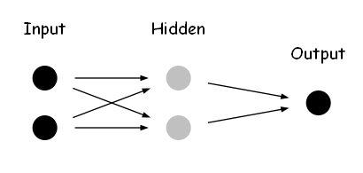

# Multiple Layer Perceptron

so, we will continue explore the XOR Gate, and we will try to use a simple 3 layer perceptron to, just like following:

# Next step

我们应该继续学习XOR问题。这是一个非常重要的步骤，原因如下：

1. XOR问题的重要性：
   XOR（异或）问题在神经网络的历史中占有重要地位。它是一个简单但非常有启发性的问题，展示了单层感知器的局限性，同时也引出了多层神经网络的必要性。

2. 理解线性可分与非线性可分：
   通过对比AND、OR和XOR问题，我们可以深入理解线性可分和非线性可分问题的区别。这是理解神经网络能力的关键。

3. 引入多层感知器：
   XOR问题无法用单个感知器解决，这自然引导我们进入多层感知器（MLP）的学习。这是向更复杂的神经网络结构过渡的重要一步。

4. 理解隐藏层的作用：
   通过实现解决XOR问题的多层感知器，我们可以直观地理解隐藏层在神经网络中的作用，即如何将非线性问题转化为线性可分的问题。

5. 学习反向传播：
   XOR问题为学习反向传播算法提供了一个很好的起点。这是训练多层神经网络的核心算法。

6. 可视化和理解：
   XOR问题在二维平面上很容易可视化，这有助于我们直观地理解神经网络如何学习复杂的决策边界。

接下来的步骤可以是：

1. 尝试用单个感知器解决XOR问题，观察其失败。
2. 设计一个简单的多层感知器（通常两层足够）来解决XOR问题。
3. 实现前向传播算法。
4. 学习并实现反向传播算法。
5. 训练网络并观察其如何成功解决XOR问题。
6. 可视化结果，包括决策边界的变化过程。

通过这个过程，我们可以自然地过渡到更复杂的神经网络结构和算法，为进一步学习深度学习打下坚实的基础。您觉得这个计划如何？我们可以从哪一步开始？