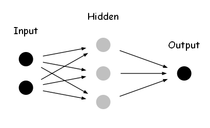

# Multiple Layer Perceptron

so, we will continue explore the XOR Gate, and we will try to use a simple 2 layer(hidden layer and output layer, these 2 layer all have weight and bias parameter) perceptron to, just like following:

we have 2 node to input and 3 hidden node and 1 output node.

and now, let's focus on this 

# Forward Pass

for the forward pass, it very similar to the perceptorn, just use the weights and bias to calcualte the vaule and move to next steps. A little bit different is it become the array calculate.

## 1 input forward pass

### Input --> Hidden

$$
Hidden_{1\times3} = f_a(Input_{1\times2} \cdot Weights_{2\times3}^{hidden}+Bias_{1\times3}^{hidden})
$$

### Hidden --> Output

$$
Output_{1\times1}=f_a(Hidden_{1\times3}\cdot Weights_{3\times1}^{output}+Bias_{1\times1}^{output})
$$

$f_a$: the activation function

$Input_{1\times3}$: 1 group input

$Weights_{2\times3}^{hidden}$: hidden layer perceptron weights

$Bias_{1\times3}^{hidden}$: hidden layer perceptron bias

$Weights_{1\times3}^{output}$: output layer perceptron weights

$Bias_{1\times1}^{output}$: output layer perceptorn bias

we will consider the batch input forward pass after, which Input matrix will expand to $Input_{4\times2}$

# How MLP learn

## The trouble about MLP learn

But when it comes to the learning process, we have trouble.

Compared with the single perceptron, where the output can be directly influenced by the weight and bias, the MLP is different. The output is decided not only by the output layer perceptron but also by the hidden layer perceptrons.

## Something sparked by old Delta rule

Recall the old Delta rule, we used the following guide to create the delta rule:

- If the perceptron's prediction is too high, we need to decrease the weights.
- If the prediction is too low, we need to increase the weights.
- The amount of adjustment should be proportional to the error and the input value.

So the important things are error and input.

## Extending the idea to MLP

While the Delta rule works well for single layer perceptrons, we need to extend this idea for MLPs. We still want to adjust our weights and bias based on the error, but now we have multiple layers of weights to consider.

The key question becomes: How do we quantify the error for each layer, especially the hidden layers?

To answer this, let's start by looking at the output layer. We can easily calculate the error here by comparing our prediction with the actual target value. But how do we measure this error precisely?

## Introducing the Loss Function

This is where the concept of a loss function comes in. A loss function helps us quantify how "wrong" our predictions are. It gives us a single number that represents the error of our entire network.

One of the most common and intuitive loss functions is the Mean Squared Error (MSE). Which is
$$
\begin{align}
Error &= \frac{1}{N}\times(Target-Output)^2\\
      &=\frac{1}{N}\times\sum_{i=1}^{N}(target_{i}-output_{i})^2
\end{align}
$$
Obviously

$N$: is the number of output sample and target sample

$Output, Target$: Output is our predictions and Target is our goal

By using MSE, we now have a clear, numerical representation of our network's performance.

The next question is: How do we use this loss function to adjust the weights in all layers of our network, including the hidden layers? This leads us to the concept of back propagation, which we'll explore next.

# Back propagation

our goal is simple, we should get the minum of the loss function, so we just analyse the loss function as the mathematical.

[back propagation mathematical derivation](./BackPropagation.md)

> this file only explore and derive the adjustment of every parameter, not the matrix adjustment

# Talk is cheap, show me the code

again, we come to code part, first let's try to build a MLP class. But seems we just considered the 3 layers MLP, so we just start with 3 layer MLP(because mulitple layer too hard to me coding)

## Initialize the Weights and Bias

在初始化神经网络权重时，选择合适的权重范围和分布非常重要。合适的初始权重可以提高网络的训练速度，避免梯度消失或梯度爆炸等问题。

关于权重范围，一般来说，权重初始值应该非常接近零但不等于零。这是因为，如果所有权重都初始化为零，每个神经元将会学习相同的特征，这将限制网络的表达能力。以下是一些建议的初始化方法：

1. **均匀分布**：权重可以从一个较小范围的均匀分布中随机抽取。例如，可以从`[-0.1, 0.1]`的范围内抽取权重。但是，这种方法可能导致神经元之间的对称性问题。

2. **正态分布**：权重可以从均值为0、标准差较小的正态分布中随机抽取。例如，可以使用标准差为0.01的正态分布。这种方法在实践中表现较好，但仍然可能存在梯度消失和梯度爆炸问题。

3. **Xavier/Glorot 初始化**：这种方法根据输入和输出神经元的数量自动调整权重范围。对于一个具有`n_in`输入神经元和`n_out`输出神经元的全连接层，权重可以从均匀分布`[-sqrt(6 / (n_in + n_out)), sqrt(6 / (n_in + n_out))]`中抽取，或者从均值为0，标准差为`sqrt(2 / (n_in + n_out))`的正态分布中抽取。

4. **He 初始化**：这种方法适用于ReLU激活函数及其变种。与Xavier初始化类似，权重可以从均匀分布`[-sqrt(6 / n_in), sqrt(6 / n_in)]`中抽取，或者从均值为0，标准差为`sqrt(2 / n_in)`的正态分布中抽取。

总之，对于大多数情况，我建议使用Xavier/Glorot初始化或He初始化，因为它们已经在许多实际应用中证明了其效果。但是，请注意，这些初始化方法的效果可能因激活函数和网络结构的不同而有所不同。因此，在实际应用中，请根据您的具体情况进行调整。

主要原因有:

1. 标准正态分布的取值更集中在0附近,初始化权重timers太大会导致梯度消失,太小会导致梯度爆炸。标准正态分布可以平衡二者。

2. 从数学上讲,大量随机变量符合正态分布时,他们的平均值接近于0。这可以消除不同初始化所造成的偏差。

3. 随着层数的增加,均匀分布随机值经过多次矩阵相乘,根据中心极限定理会逐渐接近正态分布。使用标准正态分布初始化可以 Skipping这个收敛过程。

4. 多数权重初始化方法如 Xavier 和 He 初始化都使用了标准正态分布。

5. 大量实验结果也表明标准正态分布初始化使网络更容易收敛,精度更高。

[more details here](./InitializeParameter.md)

# Next step

我们应该继续学习XOR问题。这是一个非常重要的步骤，原因如下：

1. XOR问题的重要性：
   
2. 理解线性可分与非线性可分
   
3. 引入多层感知器
   
4. 理解隐藏层的作用：
   
5. 学习反向传播
   
6. 可视化和理解：
   XOR问题在二维平面上很容易可视化，这有助于我们直观地理解神经网络如何学习复杂的决策边界。

接下来的步骤可以是：

1. 尝试用单个感知器解决XOR问题，观察其失败。
2. 设计一个简单的多层感知器（通常两层足够）来解决XOR问题。
3. 实现前向传播算法。
4. 学习并实现反向传播算法。
5. 训练网络并观察其如何成功解决XOR问题。
6. 可视化结果，包括决策边界的变化过程。

通过这个过程，我们可以自然地过渡到更复杂的神经网络结构和算法，为进一步学习深度学习打下坚实的基础。您觉得这个计划如何？我们可以从哪一步开始？